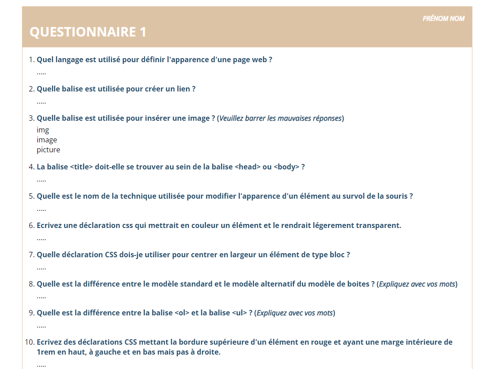
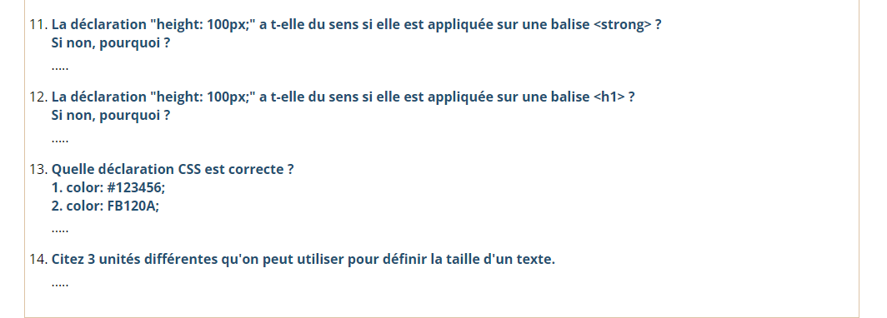

Consigne :

Ce devoir consiste en une partie théorique et une partie pratique.
Vous trouverez ci-joint un fichier .txt et deux images :

Le fichier txt contient une liste de question. Vous devez reproduire le question en html/css pour qu’il ressemble au maximum aux images jointes. 

Veuillez ensuite répondre aux questions, directement au sein du fichier html.